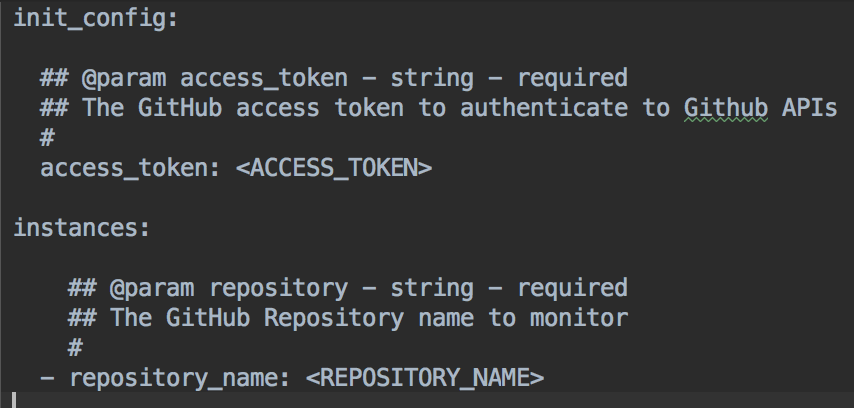

(You can find our completed solution in the `/workspace/solution` folder, as generated from the steps outlined below.)

# Edit the configuration file

Add the following content to `github_repo/assets/configuration/spec.yaml` and sync the configuration file:

**TODO**: This is outdated, should link to spec.yaml

# Init

Edit the `github_repo/datadog_checks/github_repo/github_repo.py` file.  
- Add an `__init__` method to retrieve your `access_token` from the `init_config` section of your configuration.
- Check that the `access_token` is set correctly; otherwise, raise a `ConfigurationError` error.

# Check

Edit the `github_repo/datadog_checks/github_repo/github_repo.py` file. 
- Similar to what you did with the `__init__` method, fetch and validate the `repository_name` parameter.

- Use both parameters in your logic. Catch exceptions that may be raised by the `PyGithub` library.

We created the following method to avoid code duplication:

# Test

Edit the `github_repo/tests/test_github_repo.py` file with the following code:

__NOTES:__ 

- Replace `<YOUR_ACCESS_TOKEN>` with your Github access token.

We are using the `instance` parameter in the test method `def test_check_invalid_configs(instance):`
As a result, the `repository_name` parameter for that instance needs to be set.

Add the following code to `github_repo/tests/conftest.py`:

